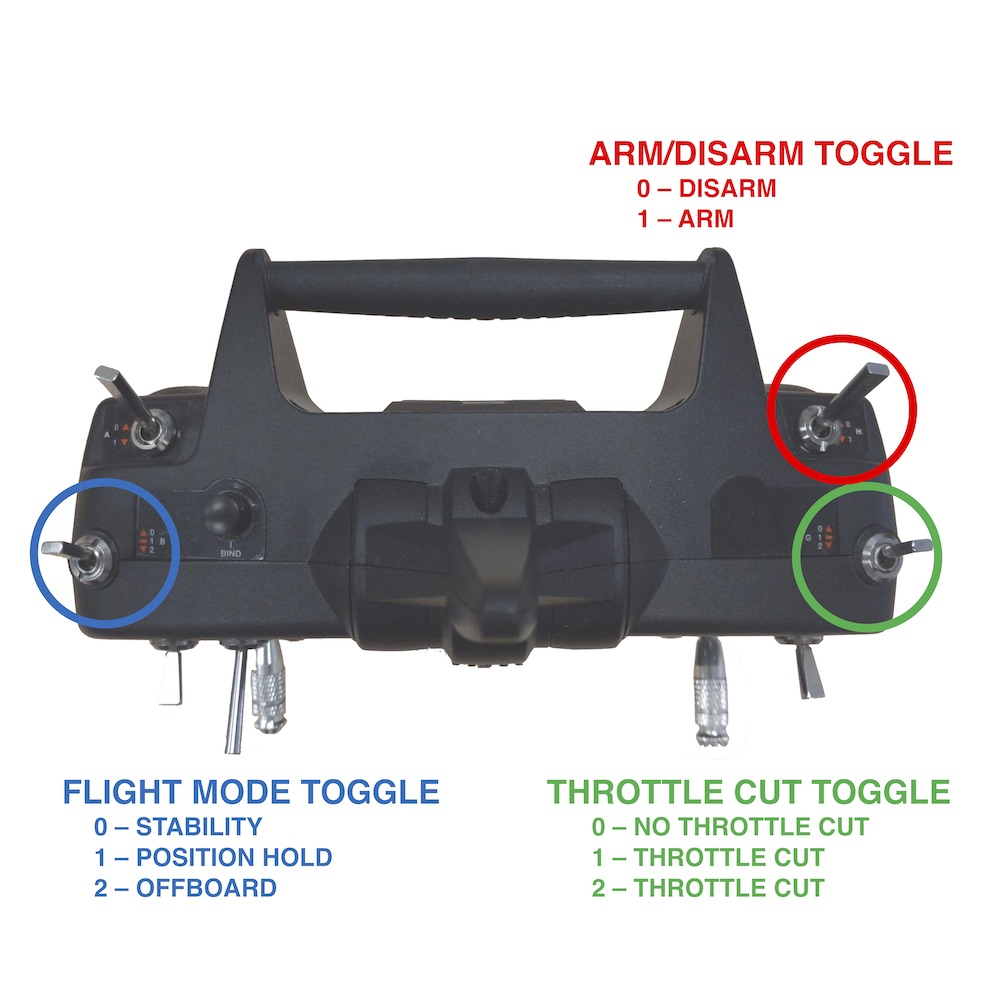

==================
Remote Controllers
==================

.. meta::
    :description lang=en: Hardware page for the quadrotor's remote control transmitter.

The quadrotors require a standard remote control transmitter to 

* arm the flight controller, 
* select flight control modes, 
* fly manually, and
* perform emergency landings. 

We use the Spektrum DX6e 6-channel transmitter. This page documents the configuration of this transmitter and its use with the quadrotors. 

Configurations
------------------

There are three transmitter features to be familiar with: 1) the control sticks, 2) the flight mode toggle, and 3) the arm/disarm toggle and the throttle cut toggle. 

**Control Sticks**
The control stick control the throttle, roll, pitch, and yaw of the quadrotor. The *zero configuration* is illustrated in the image below where all sticks are at the center of their range. 

**Flight Mode Toggle**
The flight mode toggle switches between stability mode (0), position hold mode (1), and offboard mode (2). 

**Arm/Disarm Toggle**
The arm/disarm toggle arms (1) or disarms (0) the quadrotor. The optional throttle cut switch cuts the throttle if moved from the (0) position. This is a last resort option to stop the motors from spinning. *DO NOT* cut throttle in flight as the quadrotor will drop to the ground. 

.. image:: spektrum_configuration_front.jpg
  :width: 310px
  :alt: Spektrum Configuration Front
  :align: left

Use
------------------

Please read this entire section before attempting to fly a quadrotor -- even autonomously. Familiarity with the emergency landing procedure can save quadrotors, time, and prevent injuries. 

**Preflight Check**

* Ensure throttle is all the way down (not in the zero configuration)
* Ensure all switches are set to the default 0 position
* Launch quadrotor mocap ROS nodes (the quadrotor cannot fly without pose feedback from mocap)

.. TODO:: Add a link here to the mocap documentation page

**Arm Procedure**

* Perform preflight check
* Arm quadrotor's safety button located on the flight controller
* With thottle down, slide yaw control all the way to the left and hold for 2 seconds
* Flip the arm toggle to 1
* The drone is now armed and ready for flight

**Disarm Procedure**

* Flip the arm toggle to 1
* With thottle down, slide yaw control all the way to the right and hold for 2 seconds
* Disarm quadrotor's safety button located on the flight controller
* The drone is now safe to be handled

.. TODO:: Maybe we can refer to another page that specifies the different flight modes so we don't clutter this page? Then each of the following sections can just link to that page. 

**Stability Flight**

Stability mode enables you to fly the quadrotor manually using the transmitter as you would expect on a normal drone. Here, the throttle stick position is proportional to thrust. To fly manually in stability mode:

* Arm the quadrotor
* Take off by gently increasing the throttle

**Position Hold Flight**

Position hold flight uses mocap pose feedback to keep the quadrotor hovering at desired waypoints. These waypoints are set using the transmitter's control sticks. Here, all of the sticks *must* be set in the zero configuration (in the middle of their range). Deviation from the zero configuration modifies the new waypoint. For example, if the quadrotor is hovering and you increase the thottle stick from the zero configuration upwards, the quadrotor will fly higher. This is *different* from stability flight. To fly in position hold mode:

* Arm the quadrotor
* Flip flight mode toggle to the 1 position
* Ensure all sticks are in the zero configuration
* Take off by gently increasing the throttle
* Remember to return the sticks to the zero configuration if you want the quadrotor to hover
* Land by decreasing the throttle gently

**Offboard Flight**

Offboard flight allows the quadrotor to maneuver according to external commands. The sticks on the transmitter will *not* respond in this mode. It is important to be prepared to switch out of offboard mode when testing autonomous flight in case there is an emergency and you need to land manually (either in position hold or stability mode). To fly in offboard mode:

* Arm the quadrotor
* Flip flight mode toggle to the 2 position (the quadrotor is now awaiting commands)
* Launch external command node (be careful as the quadrotor will immediately respond)

**Emergency Landing Procedure**

In the event of an emergency:

* Switch the quadrotor to stability flight
* Gently decrease the throttle to land
* Disarm the quadrotor
* [Optional] Cut throttle by setting the thottle cut toggle to 1 or 2
