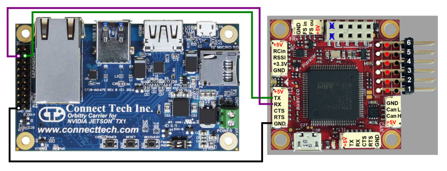
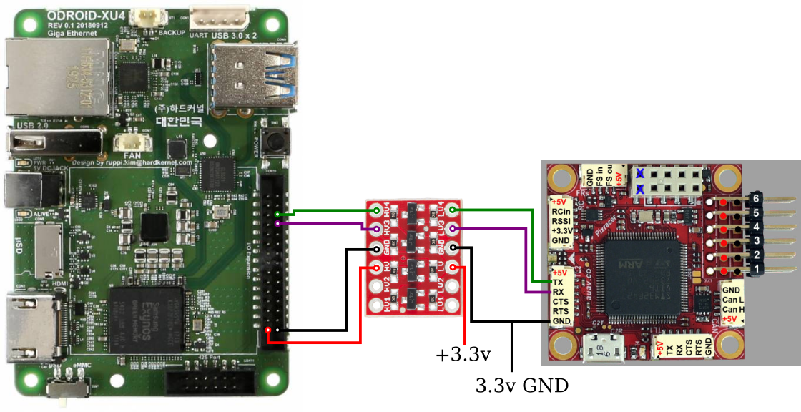

===============
Wiring Diagrams
===============

Interfacing an NVIDIA TX2 on an Orbitty Carrier with a Pixracer
---------------------------------------------------------------
Using the serial interface:

================= ================ ======================== ===============
On the Orbitty Carrier, connect... to the Pixracer...
---------------------------------- ----------------------------------------
**IO Header Pin** **Description**  **TELEM2 Connector Pin** **Description**
================= ================ ======================== ===============
3                 UART0 TX 3.3v    3                        RX (IN) 3.3v
4                 UART0 RX 3.3v    2                        TX (OUT) 3.3v
16, 18, 19, or 20 GND              6                        GND
================= ================ ======================== ===============

Diagram:

| **Resources**:
| `Orbitty Carrier <http://connecttech.com/product/orbitty-carrier-for-nvidia-jetson-tx2-tx1/>`_ board product page with technical references.
| `Pixracer <https://docs.px4.io/v1.9.0/en/flight_controller/pixracer.html>`_ documentation page.

Interfacing an ODROID-XU4 with a Pixracer
-----------------------------------------
**WARNING**: using the serial interface on the ODROID-XU4 requires a logic level shifter, as the ODROID uses 1.8v logic and the Pixracer uses 3.3v logic. 

Using the serial interface:

================= ======================== ======================== ===============
On the ODROID-XU4 CON10 header, connect... to the Pixracer...
------------------------------------------ ----------------------------------------
**IO Header Pin** **Description**          **TELEM2 Connector Pin** **Description**
================= ======================== ======================== ===============
8                 UART_0.TXD 1.8v          3                        RX (IN) 3.3v
6                 UART_0.RXD 1.8v          2                        TX (OUT) 3.3v
2, 28, or 30      GND                      6                        GND
================= ======================== ======================== ===============

Diagram, using a `Sparkfun Logic Level Converter <https://www.sparkfun.com/products/12009>`_:

| **Resources**:
| `ODROID-XU4 <https://wiki.odroid.com/odroid-xu4/hardware/expansion_connectors>`_ expansion connectors technical reference.
| `Pixracer <https://docs.px4.io/v1.9.0/en/flight_controller/pixracer.html>`_ documentation page.