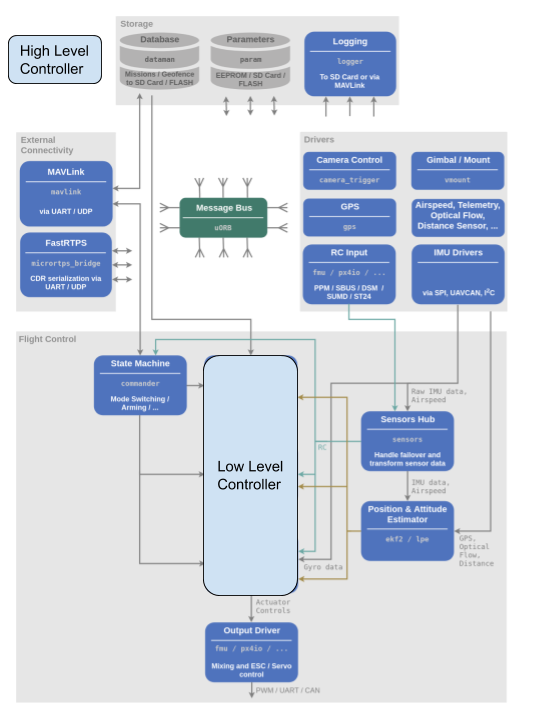

=====================
PX4 Direct Controller
=====================

Here be progress logs for the development of a state/input trajectory planning pipelinefor quadcopters using ROS and PX4. Perhaps this will get far enough that I'll polish it into a full fledged tutorial/manual.

Objective
---------
The objective is to implement a trajectory planner that can fly a quadcopter through a tightly constrained gate. 

Hardware
--------
Our hardware setup is as follows, a racing quadcopter equiped with two onboard computers: 1) a PixRacer running a modification of the PX4 firmware. 2) an UpBoard (an Intel® ATOM™ x5-Z8350) running ROS Melodic (on Ubuntu 18.04) with modified mavros and mavlink packages. We use this setup to get better parity with an existent simulation setup (https://github.com/StanfordMSL/quadrotor_sim) that is run on similiar hardware. We skip feasibility testing with other Linux flavours and CPU architectures. 

Another point on the hardware is that the focus here is the controls aspect of the pipeline so we simplify the challenge of state estimation by assuming we have access to an accurate source of the full state (i.e IMU + Mocap fusion) and we simplify communication by using a wired connection between the two computers. As will be emphasized later, we run the more time consuming part of the control pipeline separate from the rest of the control. This framework ensures that safety guarantees are focused on the low-level controller.

Pipeline
--------

.. image:: ../_static/images/px4_direct_control/pipeline.png

We split the pipeline into two key components, the "High Level Controller" and the "Low Level Controller". The job of the former is to solve and simulate the entire trajectory while the job of the latter is to execute the resultant motor commands to achieve said trajectory. We split it as such because the former can take long to solve while the latter needs to be run at a high rate for aggressive trajectories (let's say 200Hz).

As an example, let's use the differential flatness approach introduced by Mellinger. The High Level Controller would correspond to the solving of the piecewise QP problem. This produces a flat output trajectory that is fed into back into the differential flatness transform (the Low Level Controller) to generate the wrench input necessary. Note that this architecture is general and the same partition can be applied to many other approaches (e.g for iLQR High Level would generate the feedback and feedforward matrices and the Low Level would generate the input wrench using said matrices and an estimate of current state). For clarity, I shall define the wrench to be thrust (Fz) and roll, pitch and yaw torques (Mx, My, Mz respectively). Let us also define the intermediate variables (e.g the flat outputs or the feedback and feedforward matrices) as the trajectory nominal (traj henceforth). This name is based on the fact that these values are the product of a nominal trajectory that was simulated using the High Level Controller.

In PX4 Architecture
-------------------
We want to implement this into PX4 so that we can leverage its already existing safety and state estimation features. Given the high rates need for control and the necessary communication between a variety of devices (computers and sensors both onboard and offboard), developing a test platform from the ground up would be too time consuming. 

So here is where it fits into the PX4 architecture.

Seems deceptively simple. But underneath those blocks, there's a bunch of work across three different repos that we need to implement 1) ROS, 2) mavros/mavlink and 3) PX4 itself. Thankfully, with the right approach, we need only implement the pipeline once for the mavros/mavlink and PX4 components, leaving the customization (specifically... the implementation of our research work) of the high-level controller as purely a ROS problem.

===================== old ======================

it has to publish a uORB message that contains the traj data. This is then fed into a low level controller using the
existent Message Bus. We then replace the pos->att->rate control module sequence with our own custom module that does
the necessary computation where it subscribes to traj and x to output u. 

Implementation Thoughts
-----------------------
A few points that are worth noting.
1. Failsafe: The ONLY failsafe response that I will be encoding is a complete kill. I do not plan to do any sophisticated
recovery like a 'return to hover' etc. Reason is that I intend to fly at high speeds (where recovery is unlikely even with
perfect state estimation).
2. A submodule approach allows this type of controller to exist within the larger px4 repo. I feel that development of such
low level controls would be beneficial to the research community and so I want to implement it in a way that can be supported
in the long term. Thanks to the submodule architecture of the px4 flight software, this can be done pretty easily. We put the
low level controller as a module of its own and expose the section that does the actual f(traj,x) compute. We introduce user-definable
message types to be able to parse the traj data. And the rest (timing updates on which traj data to use etc) we implement for the
user as these are general features that would be required of any low level + high level controller.
3. Another way of seeing this high-level + low-level pairing is as division of a single controller. In the first part, you simulate
the entire trajectory. In the second part you compute the motor commands as a function of this simulated trajectory. The thing is...
you don't necessarily have to divide it as so. You could say shorten the horizon of the simulated trajectory and run it on the low-level
side. I imagine there might be benefits to that because we have less issues of 'communicating' the data between two computers AND your state
estimator is always going to give the best estimate onboard (where the IMU is. yes mocap is offboard but we can more afford a slower position
update that an attitude update. Just try flying a quadcopter with a pure mocap and no IMU). Ok anyway I digress. What I'm trying to get at
is that whatever low-level controller is supposed to do... it has to do its stuff efficiently. So #1, that piece has to be coded in simple
and efficient forms. #2 we need to kill unnecessary apps that are running on the px4. Given that we do away with the original pos->att->rate
piece... we really don't need their apps in the drone. And neither do we need stuff like navigator while we're at that. Long story short... we
need our own cmake build profile where we are especially careful with what apps we launch at boot.

Plan
----
Ok enough with my rambling on what I hope to reach in the long horizon. Here's where I try to flesh out what I have already done and plan to do.

1) [DONE] Swap out the pos->att->rate controllers in firmware with the low level controller on mc builds. For now, I subscribe to an existing
uORB topic (rc_channels) just to test. 
2) [Kinda done] Custom boot to clean up unnecessary apps. I currently do this using a separate make file: px4_fmu_v4_direct (i think that's the name?)
and then I use a file in the sd card to stop mc_rate_controller. I'll work on a proper config later on.
3) [doing now]. Define a custom uORB topic to be published from a companion computer. For now... I'll just use the diff. flat spline as my default
traj message form. It's smaller than the iLQR packet (i think?) and it'll let me figure out what kind of bandwidth/latency constraints we will have.
We might need to use the FastRTPS bridge if this turns out to be a real bottleneck. PepMS over in the px4 slack has some solutions to this. Will look there
when we get there. But for now, we'll just stream the polynomial out. Or if that's too slow, we can load it in prior to a flight. My guess is we can
get away with that if trajectories are short.

Ah yes... so testing trajectories. FOR NOW... the only trajectories I will care about is a takeoff->hover->land and a takeoff->hover->line->land. There's
a whole can of worms to uncover in terms of parameter estimation and vibration dampening effects. I'll worry about that later. Test platform...
to give us the best shot... is a pixracer+upboard combo. This lets us run full ubuntu 18 onboard in a compact package. I won't try streaming the traj
packet over wifi just yet. Gonna use a wired connection to give it the best chance.

4) tidy up mc_direct_control and the custom uORB message so that it can be easily changed between diff. flat approach and iLQR approach. this should be 
a good test of generality. I worry though as traj is really going to be very different. Can it really be generalized that way? Not sure. 
